# SocialConnect – A Community-Based Social Platform

**SocialConnect** is a full-stack community-centric social media platform designed to connect like-minded individuals. Developed using **Django (REST Framework)** and **Next.js**, this platform supports features like posting content, managing user profiles, joining communities, commenting, and real-time notifications.

-------

## ✨ Features

- 🔐 User Authentication (Register, Login, Logout)
- 👥 Community Creation, Editing & Member Management
- 📸 Post Creation with Image Uploads
- 💬 Commenting, Liking Posts
- 🧑 Profile View & Edit with Profile Picture Upload
- 🔍 Global Search (Users, Communities)
- 🧾 Friend Request System (Send, Accept, Cancel, Remove)
- 🔔 Smart Notification System for All Activities
- 💬 Group and Private Chat (Text + Voice Support)
- 📦 Django-Based Media Handling
- 🛡️ Block Users, Set Profile & Post Privacy

-------

## 📁 Folder Structure

Project:

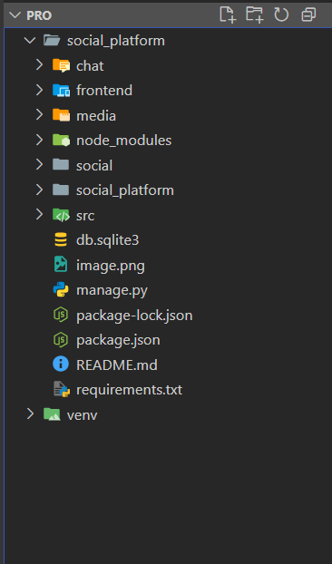


Frontend:

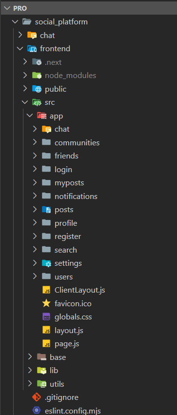


Backend:

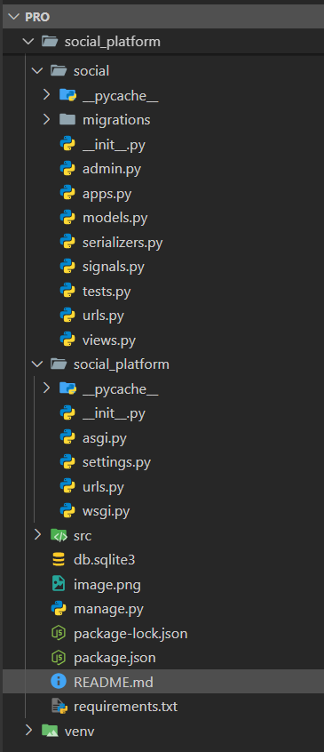


-------

## 🚀 Technologies Used

### 🖥 Frontend:
- Next.js
- React.js
- Tailwind CSS / CSS Modules
- Axios
- React Hooks (useState, useEffect)

### 🧠 Backend:
- Django
- Django REST Framework
- SQLite  / MySQL 
- CORS Headers
- JWT/Session Authentication

-------

### ⚙️ Prerequisites:
- Python 3.10+
- Node.js 18+
- MySQL (optional) or SQLite
- VS Code or any IDE

-------

## ⚙️ Setup Instructions
```bash
### 🔧 Backend (Django)

# Create virtual environment
python -m venv venv
venv\Scripts\activate   # On Windows
# source venv/bin/activate   # On Linux/macOS

# Navigate to backend directory
cd social_platform

# Install dependencies
pip install -r requirements.txt

# Run migrations
python manage.py makemigrations
python manage.py migrate

# Run server
python manage.py runserver

#Create Superuser
python manage.py createsuperuser

# Install dependencies
npm install:
Django
djangorestframework
django-cors-headers
channels (for WebSocket chat)
Pillow (image handling)
mysqlclient or mysql-connector-python (for MySQL)
daphne(chat system)

# Navigate to frontend directory
cd ../frontend

# Start development server
npm run dev

# Steps to access group chat
Instead of python manage.py runserver

Run:
daphne social_platform.asgi:application
(or)
$env:DJANGO_SETTINGS_MODULE="social_platform.settings"; daphne social_platform.asgi:application

🌐 API Base URL
http://localhost:8000/api/

🌐 Frontend Base URL
http://localhost:3000
```
------
## SocialConnect:

Login page:

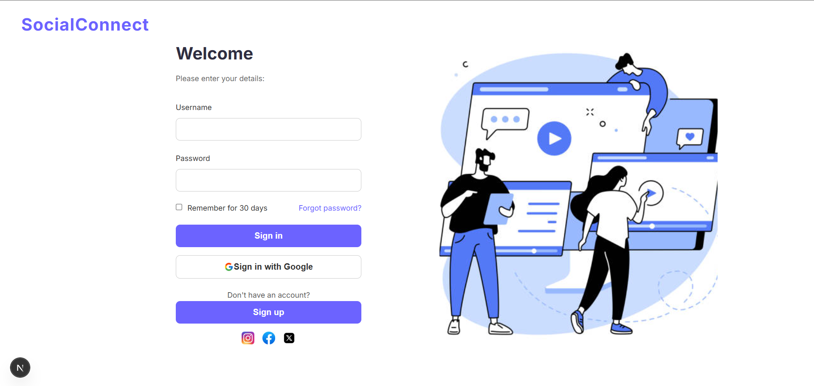


Register page:

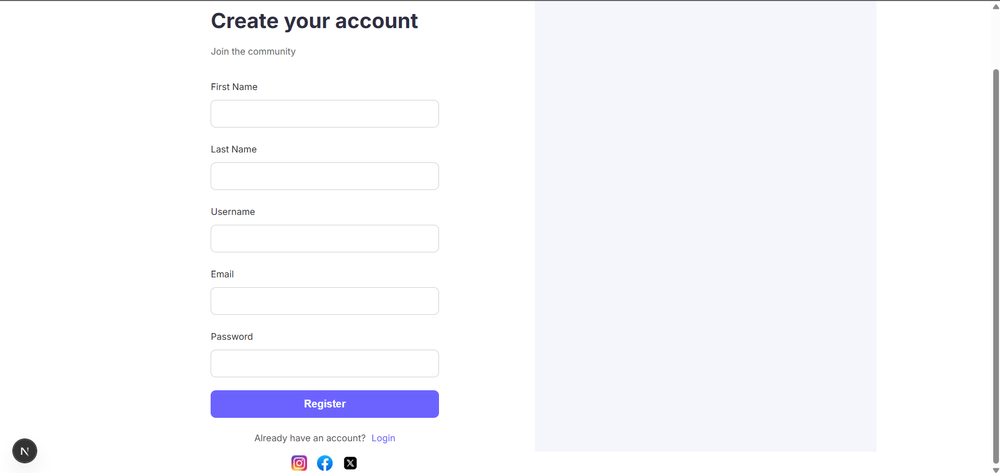


Home page:

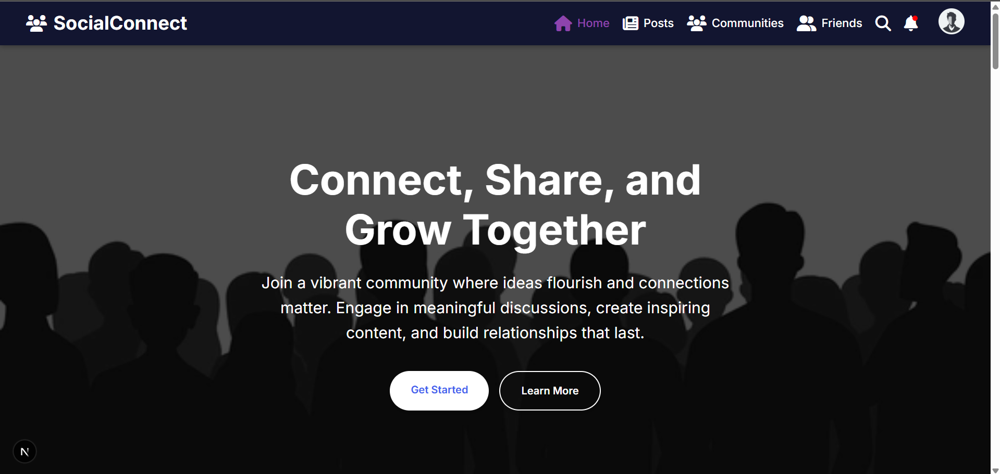
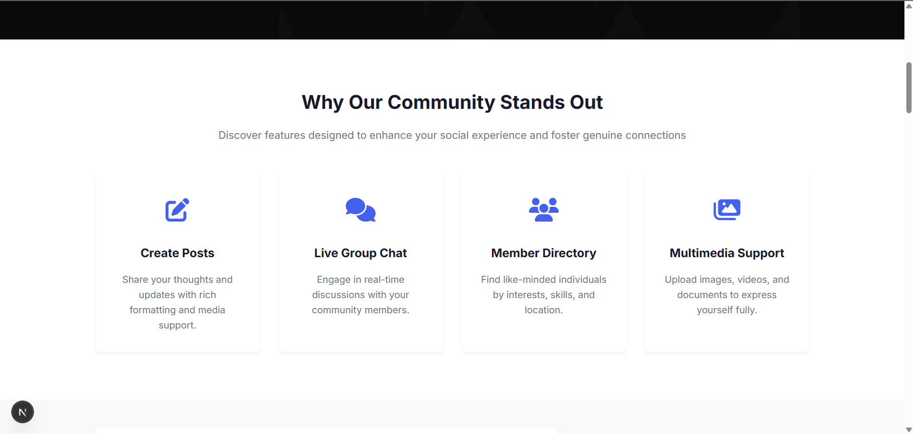
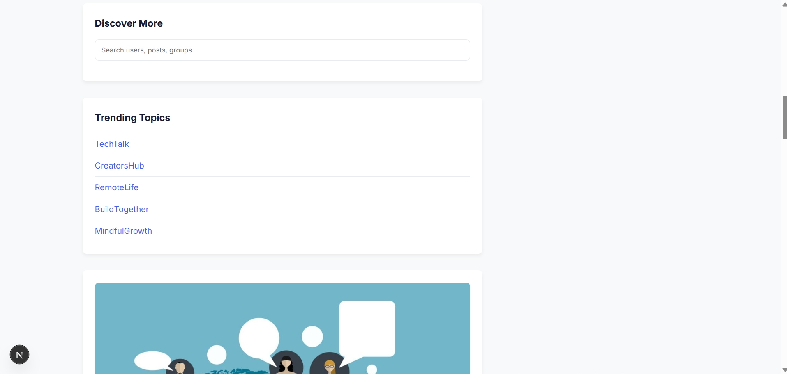
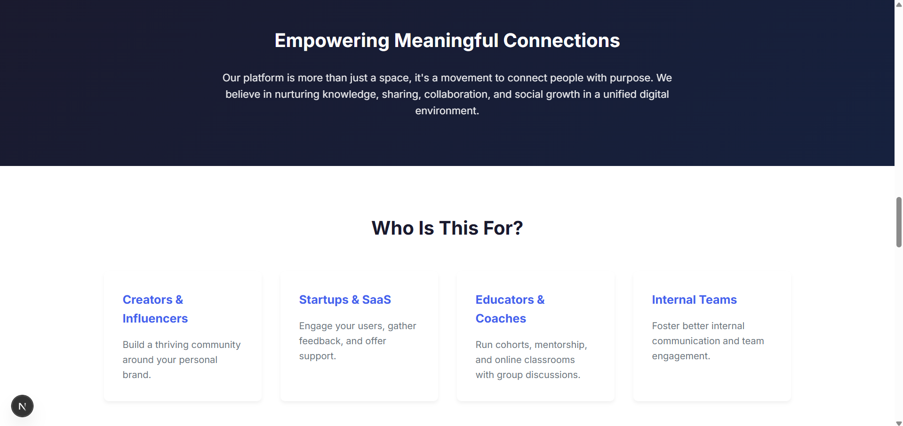
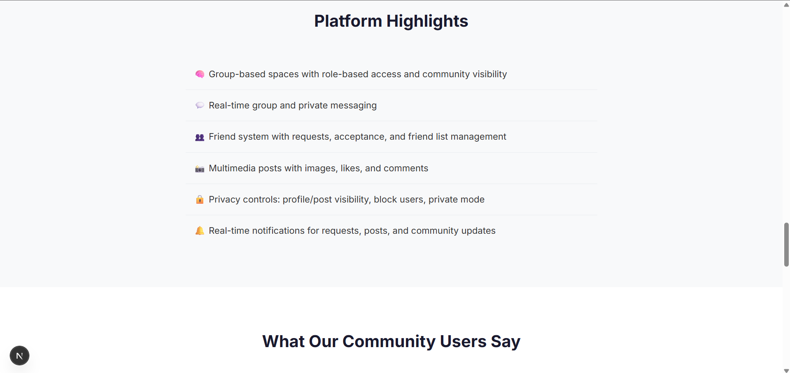
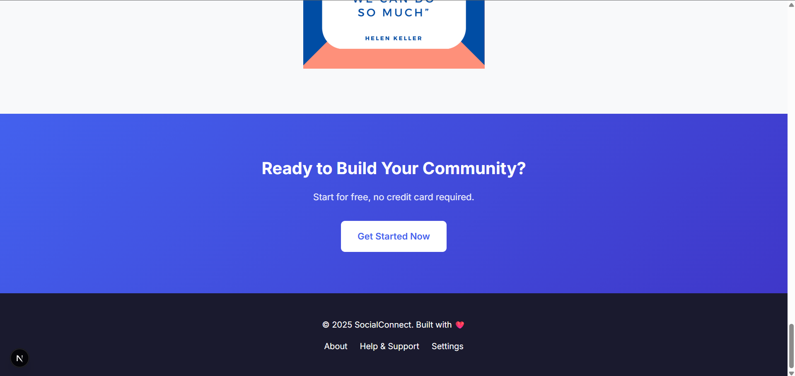


Posts page:

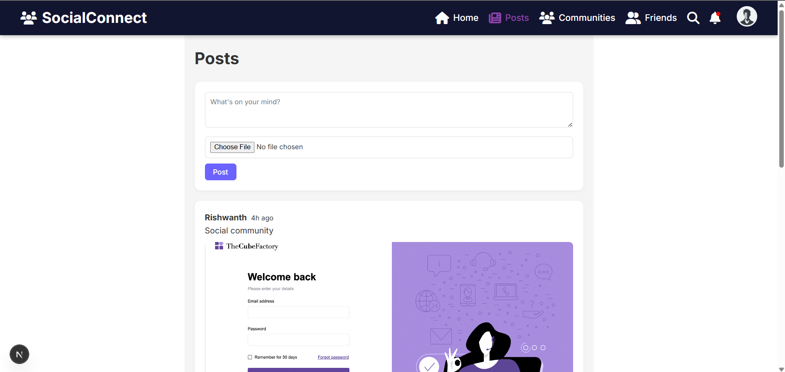
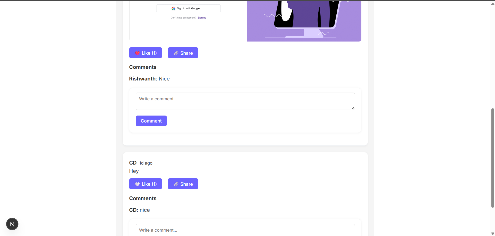


Communities page:

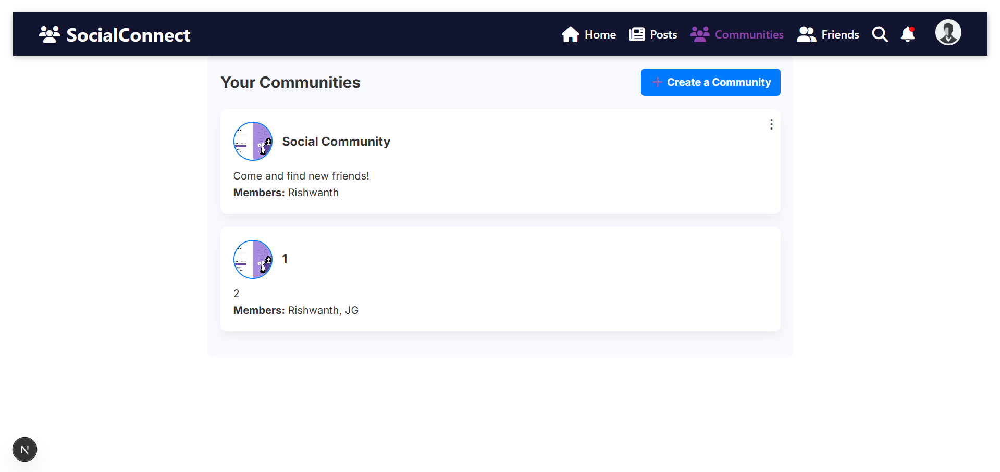


Friends page:

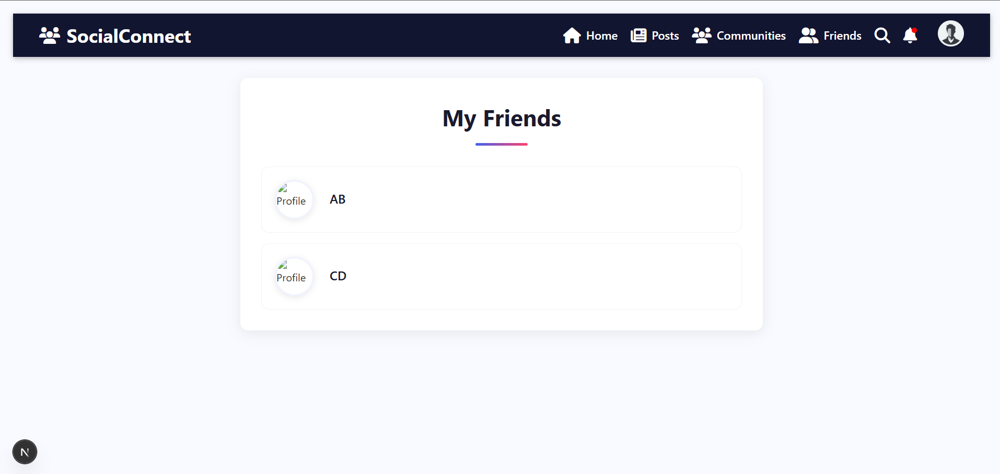


Search page:

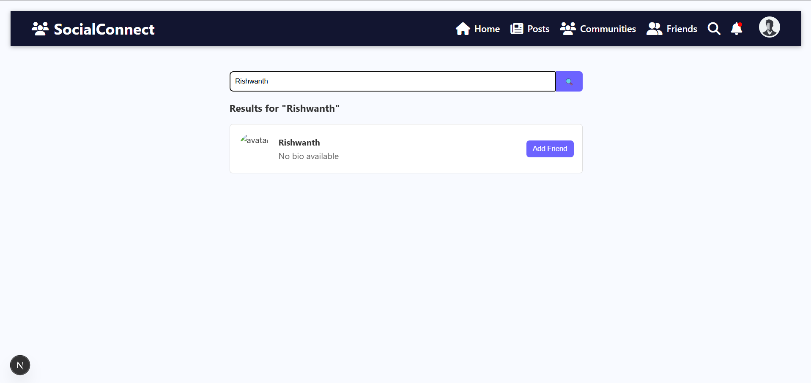


Notifications page:

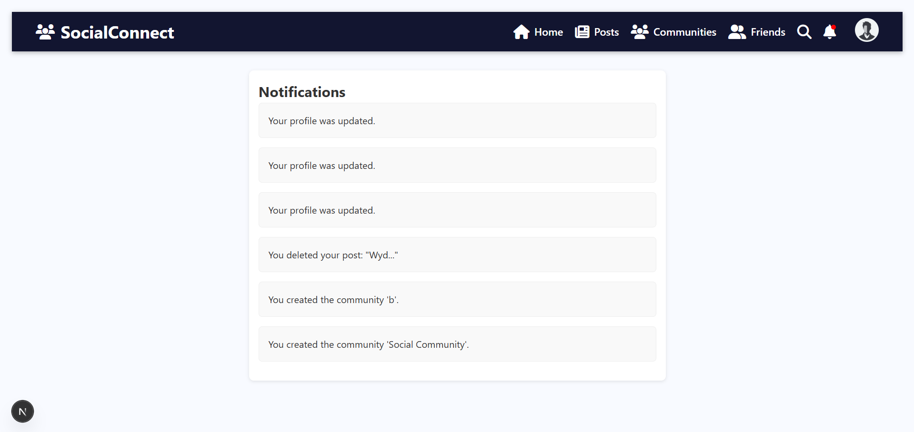


Profile page:

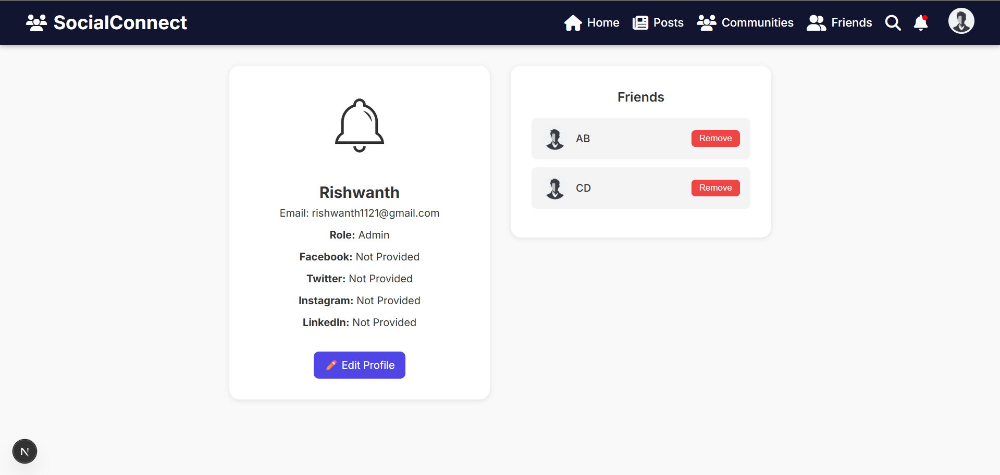


Edit_profile page:

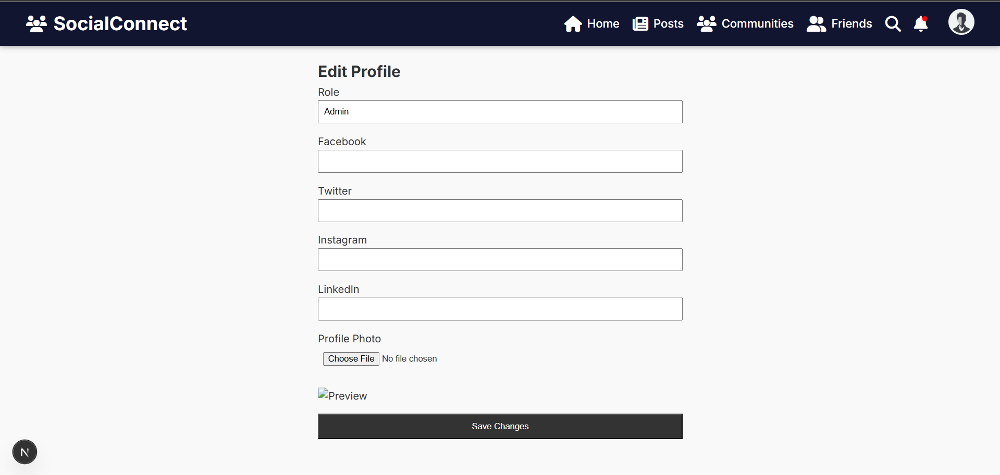


Settings page:

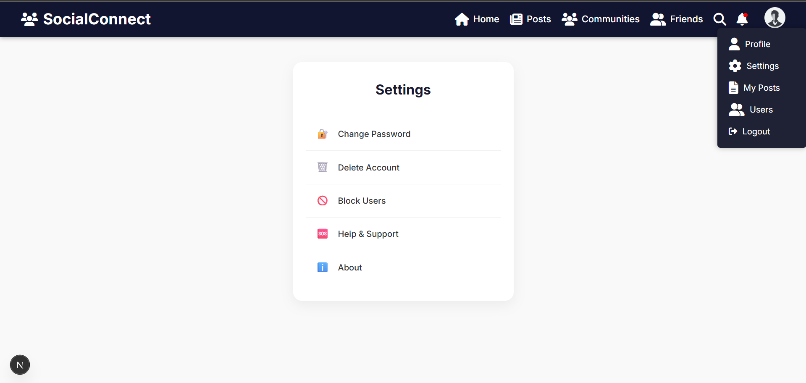


Users page:

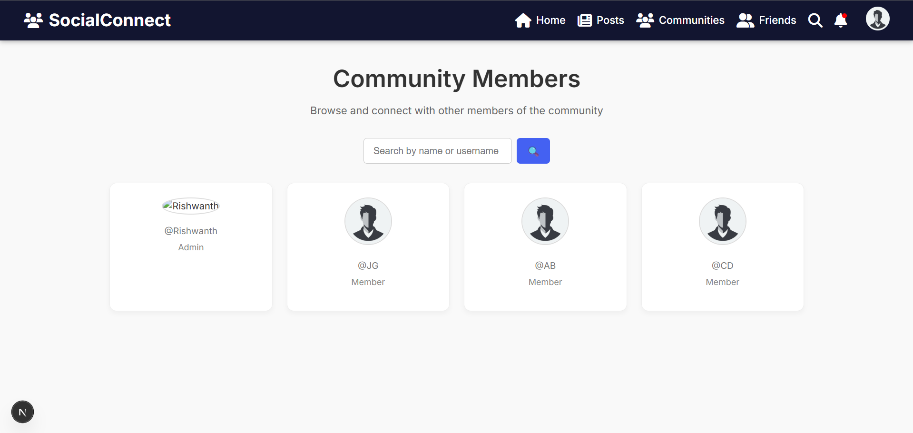

-------

Accessing private chat:

Here are the steps to access Private Chat in your SocialConnect platform.

🧑‍🤝‍🧑 1. Go to the Friends Page
Navigate to the "Friends" page via the top navbar. You’ll see a list of all your accepted friends.

💬 2. Click on a Friend's Username
From the friends list, click on the username of the person you want to chat with. This action will redirect you to the private chat page with that user.

📥 3. Start Chatting
The private chat interface will load where you can start texting.

-------

Accessing group chat:

Here are the steps to access Group Chat in your SocialConnect platform:

👥 1. Go to the Communities Page
Use the top navigation bar to go to /communities. This page shows all communities you are part of.

🏘️ 2. Click on a Community Name
Click on the name or card of the community you want to chat in. You’ll be redirected to that community’s dedicated group chat page.

💬 3. Start Messaging
You can now send real-time messages to all community members

------

✅ Contributing
We welcome contributions! If you’d like to improve the project, please fork the repo and submit a pull request. Be sure to follow the contribution guidelines.

🛠 Future Enhancements
Dark mode support
Message reactions in chat
Email verification
Admin dashboard

🙌 Acknowledgments
Thanks to the open-source community and tools that made this platform possible.

📫 Contact
For queries or collaboration:
Developer: Rishwanth M, Gowtham, Sai Pavan
Email: rishwanth1121@gmail.com, gowthamnikhil10@gmail.com
GitHub: https://github.com/Rishwanth1121

⭐️ Give a Star!
If you like the project, don't forget to ⭐️ the repository!


