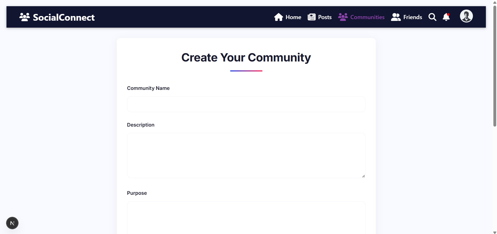
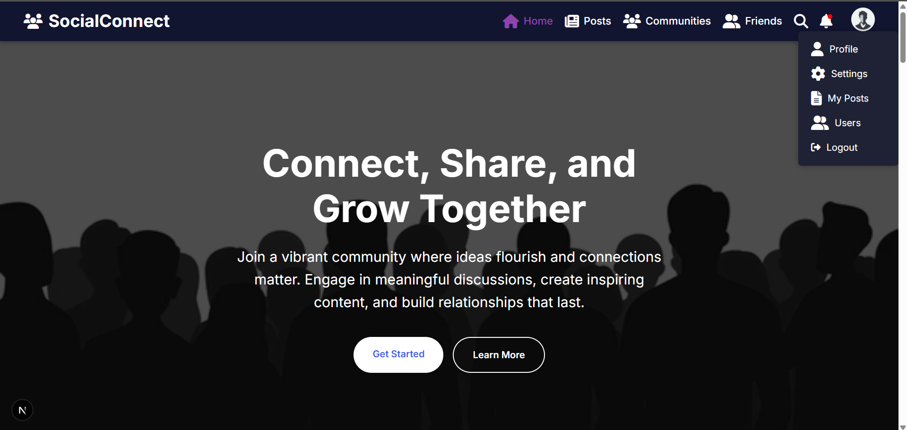

# SocialConnect – A Community-Based Social Platform

**SocialConnect** is a full-stack community-centric social media platform designed to connect like-minded individuals. Developed using **Django (REST Framework)** and **Next.js**, this platform supports features like posting content, managing user profiles, joining communities, commenting, and real-time notifications.

---

## ✨ Features

- 🔐 User Authentication (Register, Login, Logout)
- 👥 Community Creation, Editing & Member Management
- 📸 Post Creation with Image Uploads
- 💬 Commenting, Liking Posts
- 🧑 Profile View & Edit with Profile Picture Upload
- 🔍 Global Search (Users, Communities)
- 🧾 Friend Request System (Send, Accept, Cancel, Remove)
- 🔔 Smart Notification System for All Activities
- 💬 Group and Private Chat (Text + Voice Support)
- 📦 Django-Based Media Handling
- 🛡️ Block Users, Set Profile & Post Privacy

---

## 📁 Folder Structure


---

## 🚀 Technologies Used

### 🖥 Frontend:
- Next.js
- React.js
- Tailwind CSS / CSS Modules
- Axios
- React Hooks (useState, useEffect)

### 🧠 Backend:
- Django
- Django REST Framework
- SQLite (default) / MySQL (optional)
- CORS Headers
- JWT/Session Authentication

---

### ⚙️ Prerequisites:
- Python 3.10+
- Node.js 18+
- MySQL (optional) or SQLite
- VS Code or any IDE

---

## ⚙️ Setup Instructions
```bash
### 🔧 Backend (Django)

# Navigate to backend directory
cd social_platform

# Create virtual environment
python -m venv venv
venv\Scripts\activate   # On Windows
# source venv/bin/activate   # On Linux/macOS

# Install dependencies
pip install -r requirements.txt

# Run migrations
python manage.py makemigrations
python manage.py migrate

# Run server
python manage.py runserver

# Install dependencies
npm install


# Navigate to frontend directory
cd ../frontend

# Install dependencies
npm install

# Start development server
npm run dev

# Steps to access group chat


```

🌐 API Base URL
http://localhost:8000/api/

Login page:


Register page:


Home page:


Posts page:


Communities page:


Create_community page:




Friends page:


Search page:


Notifications page:


Profile_icon page:



Profile page:


Edit_profile page:


Settings page:


Users page:


